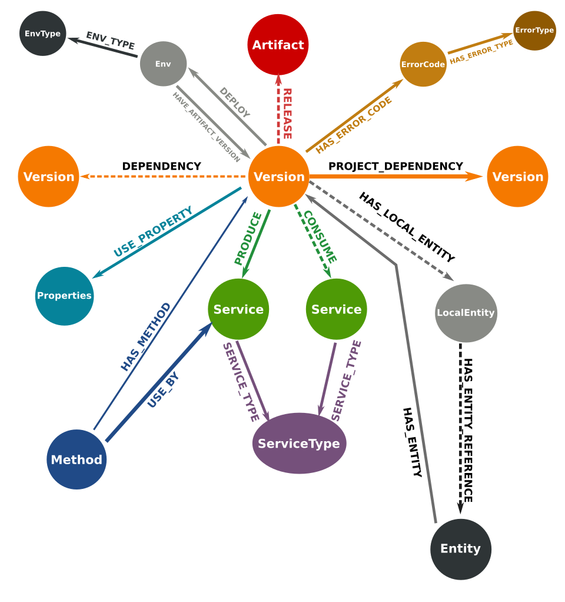

= Inugami Project analysis maven plugin
:toc:

== Last Release:
----
<dependency>
    <groupId>io.inugami.maven.plugin.analysis</groupId>
    <artifactId>inugami-project-analysis-maven-plugin</artifactId>
    <version>1.4.1</version>
</dependency>
----

== Quick start :

This maven plugin use Neo4J database to store information and resolve them.
If you haven't a Neo4J you can for test or on your local environment run a Neo4J with docker.

----
include::docker/docker-compose.yml[]
----

In your project pom.xml (or settings) we need to add some properties :

----
<properties>
    <inugami.maven.plugin.analysis.project.base.name>your.base.package</inugami.maven.plugin.analysis.project.base.name>
    <inugami.maven.plugin.analysis.writer.neo4j.url>bolt://localhost:7687</inugami.maven.plugin.analysis.writer.neo4j.url>
    <inugami.maven.plugin.analysis.writer.neo4j.user>neo4j</inugami.maven.plugin.analysis.writer.neo4j.user>
    <inugami.maven.plugin.analysis.writer.neo4j.password>password</inugami.maven.plugin.analysis.writer.neo4j.password>
</properties>
----

In your project build definition :
----
<plugin>
    <groupId>io.inugami.maven.plugin.analysis</groupId>
    <artifactId>inugami-project-analysis-maven-plugin</artifactId>
    <version>1.4.1</version>
    <extensions>true</extensions>
    <executions>
        <execution>
            <id>check</id>
            <phase>analyze</phase>
            <goals>
                <goal>check</goal>
            </goals>
        </execution>
        <execution>
            <id>info</id>
            <phase>info</phase>
            <goals>
                <goal>retrieveInformation</goal>
            </goals>
        </execution>
    </executions>
</plugin>
----

First you need to analyse your project to send into Neo4j data :

----
mvn analyze
----

After this analyse you can see in Neo4j your project informations or execute maven phase  info

----
mvn info
----

== Neo4j data structure :

== Retrieve information :

=== restServices

----
mvn info -Daction=restServices
----

----
====================================
CONSUMED REST ENDPOINTS
====================================
[GET] /lifecycles/lifecycles
	uid:bc1f3a97f9551adb324c04afcec51a88754ddf38a6c585c80455b5d6ffd2c5f883f2ecb60038002406593a17e05919d8d6e034a257c3301777dad454097fb962
	Method:io.inugami.demo.project.consumer.feign.LifecycleFeignClient.getLifecycles
	response payload:
		[
		  {
		    "serialVersionUID":"long",
		    "name":"String",
		    "title":"String",
		    "states":[
		      {
		        "name":"String",
		        "title":"String",
		        "ref":"String",
		        "role":"String",
		        "next":["<<State>>"]
		      }
		    ],
		    "statesNames":["<<State>>"],
		    "globaleStates":["<<State>>"]
		  }
		]
	Consume by:
		- io.inugami.demo:project-consumer:0.0.1-SNAPSHOT:jar
----

=== queryDisplay
----
mvn info -Daction=queryDisplay

No selected define. Queries available :
	-Dquery=search_services_rest
		description :Allow to search all rest services consume or expose by current project and these dependencies who expose/consume them

	-Dquery=search_error_codes
		description :Allow to search all error codes

	-Dquery=search_consumers
		description :Allow to search all consumed rest services
----

----
mvn info -Daction=queryDisplay -Dquery=search_error_codes

[INFO] selected query :
Match (version:Version) where version.groupId= "io.inugami.demo" and version.artifactId="project-consumer" and version.version="0.0.1-SNAPSHOT"
OPTIONAL MATCH (version)-[:PROJECT_DEPENDENCY*0..10]->(dependency:Version)-[:HAS_ERROR_CODE]->(error:ErrorCode)
return dependency,
       error
----

=== properties
----
mvn info -Daction=properties
----

=== queueInfo
----
mvn info -Daction=queueInfo
----

=== errorDisplay
----
mvn info -Daction=errorDisplay
----

=== specificsQuery
----
mvn info -Daction=specificsQuery -Dexport=true
----

.Additional configuration
|===
|Property | type | default value | description

|-Dexport
|boolean
|false
|Allow to export result as CSV file

|===

=== importData
----
mvn info -Daction=importData
----

=== Deployment management
==== publish
----
mvn info -Daction=publish
----

.Additional configuration
|===
|Property | type | default value | description

|-Denv
|String
| null
|Destination environment

|-DenvLevel
|int
| 0
|For sort environment it's necessary to add a weight on this one

|-DenvType
|String
| null
|The environment type (like DEV, INT, PREP, PROD..)

|-DautoUnpublish
|boolean
|false
|Allow remove relationship between artifact and environment node

|-DautoUnpublish
|boolean
|false
|Allow remove relationship between artifact and environment node

|-DjustThisVersion
|boolean
|false
|If you want to clean all versions relationship between artifact and environment node

|-DpreviousEnv
|boolean
|false
|For cleaning previous staging environment
|===

==== unpublish
----
mvn info -Daction=unpublish
----

.Additional configuration
|===
|Property | type | default value | description

|-Dexport
|boolean
|false
|Allow to export result as CSV file

|-DuseMavenProject
|boolean
|false
|Allow to use current project GAV and not ask for this information
|===

==== versionEnv
----
mvn info -Daction=versionEnv
----

.Additional configuration
|===
|Property | type | default value | description

|-Dexport
|boolean
|false
|Allow to export result as CSV file

|-DuseMavenProject
|boolean
|false
|Allow to use current project GAV and not ask for this information
|===

==== envInfo
----
mvn info -Daction=envInfo
----

.Additional configuration
|===
|Property | type | default value | description

|-Dexport
|boolean
|false
|Allow to export result as CSV file
|===

=== encodePassword
----
mvn info -Daction=encodePassword
----

== Analyzers :

=== Feign clients
Feign clients analyzer scan all feign client interface to resolve project consuming REST endpoints;

.Properties
|===
|Property | type | default value | description

|inugami.maven.plugin.analysis.analyzer.feign.enable
|boolean
|true
|Allow to disable feign client analyzer
|===

=== SpringBoot RestControllers
To resolve project REST endpoint exposition, this analyzer scan all SpringBoot RestController.

.Properties
|===
|Property | type | default value | description

|inugami.maven.plugin.analysis.analyzer.restControllers.enable
|boolean
|true
|Allow to disable feign client analyzer
|===

=== Spring properties
Most part of issues on project come from wrong properties configuration.
This analyzer scan all properties injected by @Value annotation or Bean configuration definition.

.Properties
|===
|Property | type | default value | description

|inugami.maven.plugin.analysis.analyzer.properties.enable
|boolean
|true
|Allow to disable feign client analyzer
|===

=== ActiveMQ
For resolve activeMQ consumers and listeners, this analyzer is able to scan all Spring @JmsListener annotation.

.Properties
|===
|Property | type | default value | description

|inugami.maven.plugin.analysis.analyzer.jms.enable
|boolean
|true
|Allow to disable feign client analyzer
|===

=== Error code
For resolve activeMQ consumers and listeners, this analyzer is able to scan all Spring @JmsListener annotation.

.Properties
|===
|Property | type | default value | description

|inugami.maven.plugin.analysis.analyzer.errorCode.enable
|boolean
|true
|Allow to disable error codeanalyzer

|inugami.maven.plugin.analysis.analyzer.errorCode.interface
|String
|io.inugami.api.exceptions.ErrorCode
|Allow to specify the error code interface, configured by default with inugami error code interface

|inugami.maven.plugin.analysis.analyzer.errorCode.fieldName
|String
|errorCode
|Allow to override the default error code "field". This field is resolve with method define in error code interface. Accessor prefix is ignore
|===

==== Sender tracking
Spring doesn't include annotation for ActiveMQ senders. Sending message is execute by calling JmsTemplate.
To retrieve this information, Inugami project have specific annotation to flag your methods who send JMS events :

----
@JmsSender(destination = "${my.activeMq.onUserCreated.queue}", id = "create.user.queue")
public void sendCreateUser(final String someParameter, @JmsSenderBody final User user) {
    // implementation
}
----

The destination have the same sens than Spring @JmsListener destination.

This specific annotation is present in inugami-project-analysis-maven-plugin-annotations :
----
<dependency>
    <groupId>io.inugami.maven.plugin.analysis</groupId>
    <artifactId>inugami-project-analysis-maven-plugin-annotations</artifactId>
    <version>${project.version}</version>
</dependency>
----

