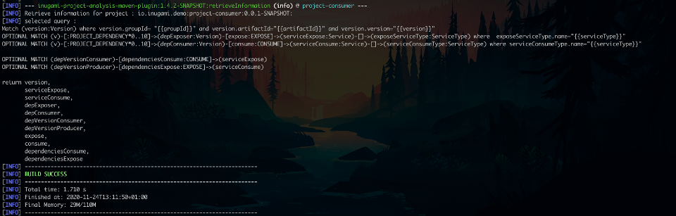

= Inugami Project analysis maven plugin
:toc:
:source-highlighter: pygments

== Last Release:
[source,xml]
----
<dependency>
    <groupId>io.inugami.maven.plugin.analysis</groupId>
    <artifactId>inugami-project-analysis-maven-plugin</artifactId>
    <version>1.4.2</version>
</dependency>
----

== Quick start :

This maven plugin use Neo4J database to store information and resolve them.
If you don't have Neo4J you can test on your local environment or run a Neo4J with docker.

.docker-compose.yml
[source,yaml]
----
version: "3"
services:
  neo4j:
    image: neo4j:4.1.1
    ports:
      - "7474:7474"
      - "7473:7473"
      - "7687:7687"
    expose:
      - 7474
      - 7473
      - 7687
    environment:
      - NEO4J_AUTH=neo4j/password
      - EXTENSION_SCRIPT=/var/lib/neo4j/import/neo4j-bootstrap.sh
      - NEO4J_dbms_unmanaged__extension__classes=semantics.extension=/rdf
      - NEO4J_dbms_security_procedures_whitelist=apoc.coll.*,apoc.load.*,semantics.*
      - NEO4J_dbms_security_procedures_unrestricted=apoc.*,semantics.*
      - NEO4J_apoc_export_file_enabled=true
      - NEO4J_apoc_import_file_enabled=true
      - NEO4J_apoc_import_file_use__neo4j__config=true
    volumes:
      - ./import:/var/lib/neo4j/import
      - ./conf:/var/lib/neo4j/conf
      - ./logs:/var/lib/neo4j/logs
      - ./plugins:/var/lib/neo4j/plugins
    networks:
      - neo4j-network
networks:
  neo4j-network:
    driver: bridge
----

In your project pom.xml (or settings) we need to add some properties :

[source,xml]
----
<properties>
    <inugami.maven.plugin.analysis.project.base.name>your.base.package</inugami.maven.plugin.analysis.project.base.name>
    <inugami.maven.plugin.analysis.writer.neo4j.url>bolt://localhost:7687</inugami.maven.plugin.analysis.writer.neo4j.url>
    <inugami.maven.plugin.analysis.writer.neo4j.user>neo4j</inugami.maven.plugin.analysis.writer.neo4j.user>
    <inugami.maven.plugin.analysis.writer.neo4j.password>password</inugami.maven.plugin.analysis.writer.neo4j.password>
</properties>
----

You can also define Neo4J configuration into your maven settings :

[source,xml]
----
<servers>
    <servers>
        <id>neo4j</id>
        <username>neo4j</username>
        <password>{Yt5nGluOZ0sHzEiL7Le2IHFjtuTonkfx4yVEG3CYzZ8=}</password>
        <configuration>
            <url>bolt://localhost:7687</url>
        </configuration>
    </servers>
</servers>
----
In this case, your maven settings will override your pom.xml properties.

In your project build definition :
[source,xml]
----
<plugin>
    <groupId>io.inugami.maven.plugin.analysis</groupId>
    <artifactId>inugami-project-analysis-maven-plugin</artifactId>
    <version>1.4.2</version>
    <extensions>true</extensions>
    <executions>
        <execution>
            <id>check</id>
            <phase>analyze</phase>
            <goals>
                <goal>check</goal>
            </goals>
        </execution>
        <execution>
            <id>info</id>
            <phase>info</phase>
            <goals>
                <goal>retrieveInformation</goal>
            </goals>
        </execution>
    </executions>
</plugin>
----

First you need to analyse your project to send data into NEO4J:

[source,bash]
----
mvn analyze
----

image::doc/analyze-01.png[]
image::doc/analyze-02.png[]

After this analyse you can see in Neo4j your project information or just execute maven phase info

[source,bash]
----
mvn info
----
image::doc/info.png[]

This phase requires to specify an action to display information

== Neo4j data structure :
image::doc/nodes.png[]

== Retrieve information :

After analyze, all information is present into Neo4J. We can now query Neo4J to retrieve
information. Attention : in some commons use cases it's easier to invoke the plugin to display result.

All additional properties can be defined in properties section of pom.xml or via command line invocation (with -D prefix).

=== restServices
One of common problems in microservice architecture is to known interconnections between services.
What's happen if I change my service ? Who consume a service and which version is currently in use ?
To address this issue, the inugami analysis plugin will analyze all Springboot Rest endpoint and feign clients
to detect interdependencies between projects.

REST endpoints can be defined in current project or as a transitive dependency. The plugin retrieve
transitive dependencies over 10 sub levels.
[source,bash]
----
mvn info -Daction=restServices
----
The color code is the same as Swagger, all GET endpoints are blue, green for POST, and red for DELETE.

image::doc/restServices-01.png[]

In case where some projects consume an endpoint these will be described in the result :

=== queryDisplay
Query display allows the generation of a Neo4J cypher query from the current projet.

[source,bash]
----
mvn info -Daction=queryDisplay
----
image::doc/queryDisplay-01.png[]

Different queries are available, so it's required to specify the one in use.

----
mvn info -Daction=queryDisplay -Dquery=search_services_rest
----

[source,bash]
----
mvn info -Daction=queryDisplay -Dquery=search_error_codes
----

=== properties
Properties action displays project properties. This action retrieves also dependencies properties.
At this moment these properties are extracted from Spring properties (@Value, bean properties, conditionals beans,
properties usages on JMS or RabbitMQ listeners)

If a property has no default value, it will be displayed in red.
In yellow, we have properties who enable some beans.
If a property have bean validator constraints, these will be displayed too.

[source,bash]
----
mvn info -Daction=properties
----

=== queueInfo
Queue information have the same approach as restServices but for JMS and RabbitMQ.
It's able to detect producers and listeners, tracing event payload and all
information on queue binding.

Like restServices, the queueInfo retrieves information over 10 levels of transitive dependencies.
[source,bash]
----
mvn info -Daction=queueInfo
----

image::doc/queue.png[]

To track all JMS senders and RabbitMQ sender it's required to add annotations in your source code.

For JMS :

[source,java]
----
@JmsSender(destination = "${my.activeMq.onUserCreated.queue}", id = "create.user.queue")
public void sendCreateUser(final String someParameter, @JmsEvent final User user) {
    // process sending event
}
----

For RabbitMQ :

[source,bash]
----
@RabbitMqSender(echangeName = "${events.exchangeName}",
                queue = "${events.method.user.queueName}",
                routingKey = "${events.user.method.created.routingKey}"
)
public void fireEvent(@RabbitMqEvent  final UserCreatedEvent event) {
    // process sending event
}
----

If you use multi-handler on RabbitLister you need to add an annotation specifying which routing key is in use :

[source,java]
----

@RabbitMqHandlerInfo(routingKey = "${events.user.authenticated.routingKey}",
typeId = "${events.user.authenticated.typeId}")
@RabbitHandler
public void onAuthenticated(final UserAuthenticatedEvent event) {
    // process listen
}
----

All specific annotations are contained into an inugami artifact :

[source,xml]
----
<dependency>
    <groupId>io.inugami.maven.plugin.analysis</groupId>
    <artifactId>inugami-project-analysis-maven-plugin-annotations</artifactId>
    <version>${io.inugami.maven.plugin.analysis.version}</version>
</dependency>
----

This artifact contains only annotations, nothing else.

=== errorDisplay
Error management is essential to make better applications. Interteam communication is a must.
Writing wiki is not our way, it's time-consuming and quickly outdate.
Inugami generates errors directly from code.
[source,bash]
----
mvn info -Daction=errorDisplay
----

Per default Inugami plugin use the Inugami error interface to detect error code :

[source,java]
----
package io.inugami.api.exceptions;
import java.util.function.BiConsumer;

public interface ErrorCode {
    public ErrorCode getCurrentErrorCode();

    default int getStatusCode() {
        return getCurrentErrorCode() == null ? 500 : getCurrentErrorCode().getStatusCode();
    }

    default String getErrorCode() {
        return getCurrentErrorCode() == null ? "undefine" : getCurrentErrorCode().getErrorCode();
    }

    default String getMessage() {
        return getCurrentErrorCode() == null ? "error" : getCurrentErrorCode().getMessage();
    }

    default String getMessageDetail() {
        return getCurrentErrorCode() == null ? null : getCurrentErrorCode().getMessageDetail();
    }

    default String getErrorType() {
        return getCurrentErrorCode() == null ? "technical" : getCurrentErrorCode().getErrorType();
    }

    default String getPayload() {
        return getCurrentErrorCode() == null ? null : getCurrentErrorCode().getPayload();
    }

    default BiConsumer<String, Exception> getErrorHandler() {
        return getCurrentErrorCode() == null ? null : getCurrentErrorCode().getErrorHandler();
    }
}
----

This interface is present in inugami_api artifact :
[source,xml]
----
<dependencies>
    <groupId>io.inugami</groupId>
    <artifactId>inugami_api</artifactId>
    <version>2.0.0</version>
</dependencies>
----

This interface can be used over enum types or on static class fields.
[source,java]
----
public enum IssuesError implements ErrorCode {

    ISSUES_1(newBuilder()
            .setStatusCode(400)
            .setMessage("issues request invalid")
            .setErrorType("input")),

    ISSUES_1_1(newBuilder()
            .setStatusCode(400)
            .setMessage("issue uid is mandatory")
            .setFonctionnalError());

    private final ErrorCode errorCode;

    private IssuesError(final ErrorCodeBuilder errorBuilder) {
        errorCode = errorBuilder.setErrorCode(this.name()).build();
    }

    @Override
    public ErrorCode getCurrentErrorCode() {
        return errorCode;
    }
}
----

You can define your error code interface, to do so just add a property in your pom.xml
[source,java]
----
<properties>
   <inugami.maven.plugin.analysis.analyzer.errorCode.interface>io.inugami.demo.spring.boot.training.api.exceptions.ErrorCode</inugami.maven.plugin.analysis.analyzer.errorCode.interface>
</properties>
----

In this case the plugin will retrieve all values defined in your interface.

image::doc/errorCode.png[]

.Additional configuration
|===
|Property | type | default value | description

|-Dinugami.maven.plugin.analysis.analyzer.errorCode.interface
|String
|io.inugami.api.exceptions.ErrorCode
|The error code interface to use

|-Dexport
| boolean
| false
| allow exporting results as CSV files
|===

=== specificsQuery
The plugin is able to retrieve information from Neo4J and display them.
If you need to execute a specific cypher query is possible to use this plugin to do that.

[source,bash]
----
mvn info -Daction=specificsQuery -Dexport=true
----

image::doc/specificQuery.png[]

.Additional configuration
|===
|Property | type | default value | description

|-Dinugami.query.path
|String
|null
|Path to cypher query, if isn't define the plugin will ask for this one in prompt.

|-Dinugami.skip.properties
|String (Regex Pattern)
|null
|for not display some nodes properties

|-Dexport
|boolean
|false
|Allow to export result as CSV file

|===

=== importData
To import some data into Neo4J it's possible to call the importData action.
This action is able to execute a cypher query or to import a JSON model.

For both it's required to specify the property *inugami.query.path* to define the import script path
[source,bash]
----
mvn info -Daction=importData
----

For cypher query is just a basic .cql script. This one must juste have for extension *.cql*. Neo4j has great documentation on cypher language : https://neo4j.com/docs/cypher-manual/current/

For the JSON model, is the internal plugin model as JSON :
[source,json]
----
{
  "nodes": [
    {
      "type": "String",
      "uid": "String",
      "name": "String",
      "properties": {
        "<String>": "Serializable",
        "<String>": 42
      }
    }
  ],
  "nodesToDeletes": ["String"],
  "createScripts" : ["String(Cypher)"],
  "relationships": [
    {
      "from": "String",
      "to": "String",
      "type": "String",
      "properties": {
        "<String>": "Serializable"
      }
    }
  ],
  "relationshipsToDeletes": [
    {
      "from": "String",
      "to": "String",
      "type": "String",
      "properties": {
        "<String>": "Serializable"
      }
    }
  ],
  "deleteScripts": ["String(Cypher)"]
}
----

.Additional configuration
|===
|Property | type | default value | description

|-Dinugami.query.path
|String
|null
|Path to cypher or JSON import script query, if it's not defined the plugin will prompt for a value.

|===
=== Deployment management

Microservices complicate the deployment process. It's very important to know which microservice is on which
environment.

==== publish
You need to pass some additional information to Neo4J to detect which artifact is on wich environment.
The easiest way is to use the "publish action".

[source,bash]
----
mvn info -Daction=publish
----

image::doc/publish-02.png[]

On *DEPLOY* we can see that the plugin has added the deployment date (on ISO date and timestamp, both are on system time zone and on UTC)
.Additional configuration
|===
|Property | type | default value | description

|-DuseMavenProject
|Boolean
| null
|Allow using current project GAV, if null the plugin will prompt for a value.

|-Denv
|String
| null
|Destination environment, if null the plugin will prompt for a value.

|-DenvLevel
|int
| 0
|To sort environments it's necessary to add weight, if null the plugin will prompt for a value.

|-DenvType
|String
| null
|The environment type (like DEV, INT, PREP, PROD..), if null the plugin will prompt for a value.

|-DautoUnpublish
|boolean
|false
|Allow remove relationship between an artifact and an environment node

|-DjustThisVersion
|boolean
|false
|If you want to clean all version relationship between an artifact and an environment node

|-DpreviousEnv
|boolean
|false
|For cleaning previous staging environment, this value will be prompted if not defined on an enabled autoPublish.
|===

==== unpublish

It's very closer than publish but in this action we will remove deployments relationship on a specific version and an
environment.

[source,bash]
----
mvn info -Daction=unpublish
----

.Additional configuration
|===
|Property | type | default value | description

|-DuseMavenProject
|boolean
|false
|Allow using current project GAV and not ask for this information

|-Denv
|String
| null
|Destination environment, if null the plugin will prompt for a value.

|-DenvLevel
|int
| 0
|To sort environments it's necessary to add weight, if null the plugin will prompt for a value.

|-DenvType
|String
| null
|The environment type (like DEV, INT, PREP, PROD..), if null the plugin will prompt for a value.

|-DjustThisVersion
|boolean
|false
|If you want to clean all version relationship between an artifact and an environment node

|===

==== versionEnv
The action versionEnv is able to verify if your project have all dependencies available on all environments.

[source,bash]
----
mvn info -Daction=versionEnv
----

In this example, the project *project-consumer* is using a REST endpoint produced by *spring-boot-training-lifecycle*.
PREP_2 is not deployed. The service project *project-consumer* can't work correctly on this
environment.

Also, this project use a REST endpoint `[GET]/comments/comments` but no producer have been detected

image::doc/versionEnv.png[]

.Additional configuration
|===
|Property | type | default value | description

|-Dexport
|boolean
|false
|Allow exporting result as CSV file

|-DuseMavenProject
|boolean
|false
|Allow using current project GAV and not ask for this information
|===

==== envInfo
This action is a quick representation of an environment deployment status. It's able to retrieve which artifacts are present
on which environments.

[source,bash]
----
mvn info -Daction=envInfo
----

.Additional configuration
|===
|Property | type | default value | description

|-Dexport
|boolean
|false
|Allow to export result as CSV file
|===

=== encodePassword
This action is just a small tool to encode a password or sensible value in AES.

[source,bash]
----
mvn info -Daction=encodePassword
----

image::doc/password.png[]

.Additional configuration
|===
|Property | type | default value | description

|-Dinugami.maven.plugin.analysis.secret
|String (16 chars)
|null
|AES passphrase
|===

== Analyzers :

=== Feign clients
Feign clients analyzer scan all feign client interface to resolve project consuming REST endpoints;

.Properties
|===
|Property | type | default value | description

|inugami.maven.plugin.analysis.analyzer.feign.enable
|boolean
|true
|Allow to disable feign client analyzer

|inugami.maven.plugin.analysis.analyzer.restControllers.strict
|boolean
|true
|if this mode isn't enable, only mandatory fields in models have been used for identify REST endpoint
|===

=== SpringBoot RestControllers
To resolve project REST endpoint exposition, this analyzer scan all SpringBoot RestController.

.Properties
|===
|Property | type | default value | description

|inugami.maven.plugin.analysis.analyzer.restControllers.enable
|boolean
|true
|Allow disabling feign client analyzer

|inugami.maven.plugin.analysis.analyzer.restControllers.strict
|boolean
|true
|if this mode isn't enable, only mandatory fields in models have been used for identify REST endpoint
|===

=== Spring properties
Bad properties configuration is the source of most problems on a spring project.
This analyzer scan all properties injected by @Value annotation or Bean configuration definition.

.Properties
|===
|Property | type | default value | description

|inugami.maven.plugin.analysis.analyzer.properties.enable
|boolean
|true
|Allow disabling feign client analyzer
|===

=== ActiveMQ
To resolve activeMQ consumers and listeners, this analyzer is scanning all Spring @JmsListener annotation.

.Properties
|===
|Property | type | default value | description

|inugami.maven.plugin.analysis.analyzer.jms.enable
|boolean
|true
|Allow disabling feign client analyzer
|===

=== Error code
To resolve activeMQ consumers and listeners, this analyzer is scanning all Spring @JmsListener annotation.

.Properties
|===
|Property | type | default value | description

|inugami.maven.plugin.analysis.analyzer.errorCode.enable
|boolean
|true
|Allow disabling error code analyzer

|inugami.maven.plugin.analysis.analyzer.errorCode.interface
|String
|io.inugami.api.exceptions.ErrorCode
|Allow to specify the error code interface, configured by default with inugami error code interface

|inugami.maven.plugin.analysis.analyzer.errorCode.fieldName
|String
|errorCode
|Allow to override the default error code "field". The method defined in error code interface resolves this field. Accessor prefix is ignored
|===

=== Git SCM (1.4.3-SNAPSHOT)
Git scm analyzer allow to extract all commit since last project tag. If your project haven't tag yet, this analyzer
retrieve all commit since repository creation.

After analyze, new nodes types appear :

- Scm, who contains all commit details
- MergeRequest, to retrace all merges requests on version. If you use feature branch, the specified issue will be retrieve too  (for example with branch name `feature/123_my_feature`, issue *123* will be extracted).
- Issue
- Issue label

To display the release note you can invoke task `mvn info -Daction=releaseNote`

image::doc/release_note_light.png[]

You can see on this example generated release-note as asciidoc : link:doc/release-note-example.adoc[release-note]

==== Issue Management
the Git scm analyzer will extract issues and merge request from commit message. On each it will call your issue
management to retrieve more information on tickets.

To enable this behavior it's require to add `issueManagement` with link to SCM API in your pom.xml :

*For GitLab :*
[source,xml]
----
<issueManagement>
    <system>gitlab</system>
    <url>https://gitlab.com/api/v4/projects/123457890</url>
</issueManagement>
----

*For GitHub :*
[source,xml]
----
<issueManagement>
    <system>github</system>
    <url>https://api.github.com/repos/inugamiio/inugami-project-analysis-maven-plugin-parent</url>
</issueManagement>
----

*For Jira :*
[source,xml]
----
<issueManagement>
    <system>jira</system>
    <url>https://jira.url</url>
</issueManagement>
----

All issue management need credentials to grant access on REST API. To configure these you will add server tag in your
maven settings.xml :

[source,xml]
----
<servers>
    <server>
      <id>gitlab</id>
      <privateKey>{MIAuTFbZUxsHC0aBub3Frxr1d/kik/yafcVYW6KDzqU=}</privateKey>
    </server>

    <server>
      <id>github</id>
      <privateKey>{s5Ydy14rYAwHekKyJxAYAFnFO6igA9/lykiQCT+ct8U=}</privateKey>
    </server>

    <server>
      <id>jira</id>
      <username>{1Jur5y14rYAwHekKyJxAYAFnFO6igA9/lyki+ct8U=}</username>
      <password>{s5Ydy14rYAwHekKyJxAYAFnFO6igA9/lykiQCT+ct8U=}</password>
    </server>
</servers>
----

It's possible to encrypt your password with maven standard encryption mechanism (https://maven.apache.org/guides/mini/guide-encryption.html)

.Properties
|===
|Property | type | default value | description

|inugami.maven.plugin.analysis.issue.tracker.pr.url
|String
|${issueManagement.url}
|If you use another repository to manage your project backlog, `issueManagement.url` must be configure on it. But to trace
merge request you should define `inugami.maven.plugin.analysis.issue.tracker.pr.url` with the issue management of your
source code repository

|===

===== Jira custom fields
Jira allow to define custom fields on your issues. To extract these you can create
a SPI implementation of interface `i.inugami.maven.plugin.analysis.api.scan.issue.tracker.JiraCustomFieldsAppender`

[source,java]
----
public interface JiraCustomFieldsAppender {
    void append(String issueId,
                JsonNode json,
                LinkedHashMap<String, Serializable> issueProperties,
                ScanNeo4jResult neo4jResult);
}
----

.Parameters
|===
|Property | type |  description

|issueId
|String
|Current issue uid

|json
|com.fasterxml.jackson.databind.JsonNode
|Tree representation of current Json response. For more information on Jira Rest API see https://docs.atlassian.com/software/jira/docs/api/REST/8.13.2/#api/2/issue-getIssue

|issueProperties
|LinkedHashMap<String, Serializable>
|Current properties

|neo4jResult
|io.inugami.maven.plugin.analysis.api.models.ScanNeo4jResult
|Allow to create another nodes or relationships
|===

Your implementation can be in classpath or linked on plugin dependencies.
All implementation must be declare into `src/resources/META-INF/services/io.inugami.maven.plugin.analysis.api.scan.issue.tracker.JiraCustomFieldsAppender`

Example :

src/resources/META-INF/services/io.inugami.maven.plugin.analysis.api.scan.issue.tracker.JiraCustomFieldsAppender :
[source]
----
io.app.JiraCustomFieldExtractor
----

[source,java]
----
package io.app;

public class JiraCustomFieldExtractor implements JiraCustomFieldsAppender {
    public void append(String issueId,
                JsonNode json,
                LinkedHashMap<String, Serializable> issueProperties,
                ScanNeo4jResult neo4jResult){
        // implementation
    }
}
----